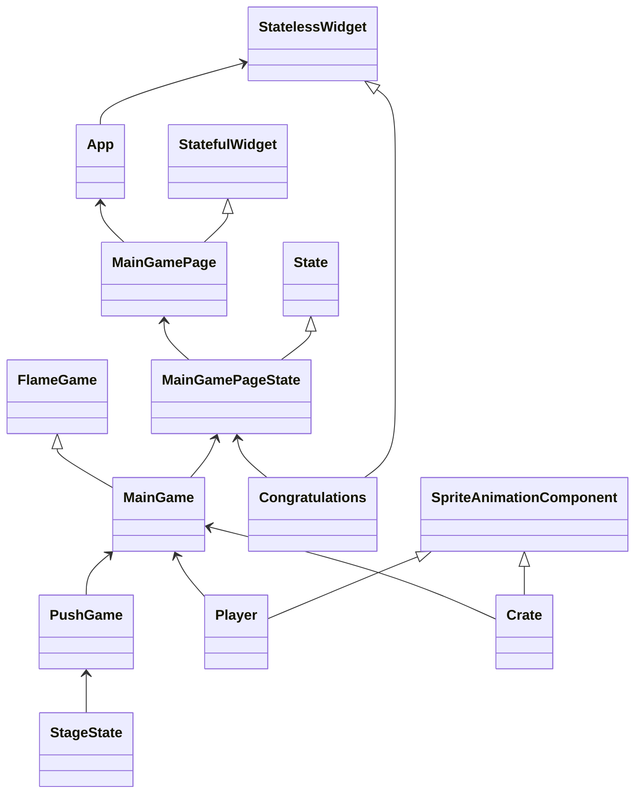
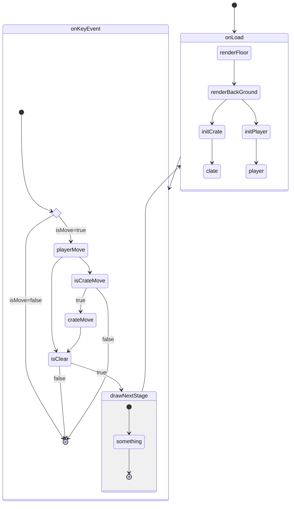
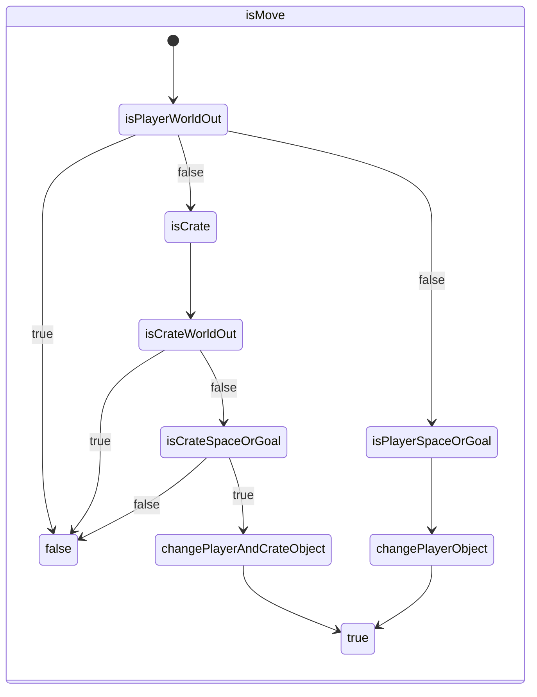

# Sokoban Push Puzzle


Click here to see a [sample](https://flame-games.github.io/push_puzzle/) of how it works on the web.

## Usage

```
flutter run
```

## Architecture

For stage data, [lib/utilty/stage_master_data.dart](https://github.com/flame-games/push_puzzle/blob/main/lib/utility/stage_master_data.dart) is referenced, and stages are generated as text data.

```dart
############
#     ## p #
#   o .. o #
############
```

The core logic of the game is located under lib/src and is mainly processed here and designed to be executable in CUI.

[lib/src/stage_state.dart](https://github.com/flame-games/push_puzzle/blob/main/lib/src/stage_state.dart) is the main process that manages the stage state, and [lib/src/push_game.dart](https://github.com/flame-games/push_puzzle/blob/main/lib/src/push_game.dart) is designed to encompass it.

Update positions of walls, characters, luggage, etc. as game conditions change.

```dart
############
#     ##   #
#  op .. o #
############
```

The other files under the lib are the Flutter and Flame processes for displaying on the screen as GUI.

## Getting Started

As for the content of the game, it is quite simple.

The stage is cleared by moving the character and carrying the luggage to the goal.

Character movement is mainly handled [here](https://github.com/flame-games/player_move).


### Input Reference

| Joypad | input | Direction |
| -------------- |:------------:|:------------:|
| UP     | LogicalKeyboardKey keyW | UP    |
| Left   | LogicalKeyboardKey keyA | Left  |
| right  | LogicalKeyboardKey keyD | right |
| Down   | LogicalKeyboardKey keyS | Down  |


## Contributor

### copyright holder

Sokoban (100+ tiles)

[Kenney](https://opengameart.org/content/sokoban-100-tiles)

Retro Character Sprite Sheet

[isaiah658](https://openclipart.org/detail/248259/retro-character-sprite-sheet)

I appreciate it very much.

## Author

**Daisuke Takayama**

-   [@webcyou](https://twitter.com/webcyou)
-   [@panicdragon](https://twitter.com/panicdragon)
-   <https://github.com/webcyou>
-   <https://github.com/webcyou-org>
-   <https://github.com/panicdragon>
-   <https://www.webcyou.com/>


## Class
※このクラス図は厳密ではなく、画面形成に直接的に関わるクラスは省略する。
例えば中間クラスのScaffoldなどは記載しない。ただし継承関係や内部処理に関わるクラスは記載する。



## Activity
特にMainGame(FlameGame)のゲームフローについて
全体の更新プロセス


Objectの更新を実施するかどうか


