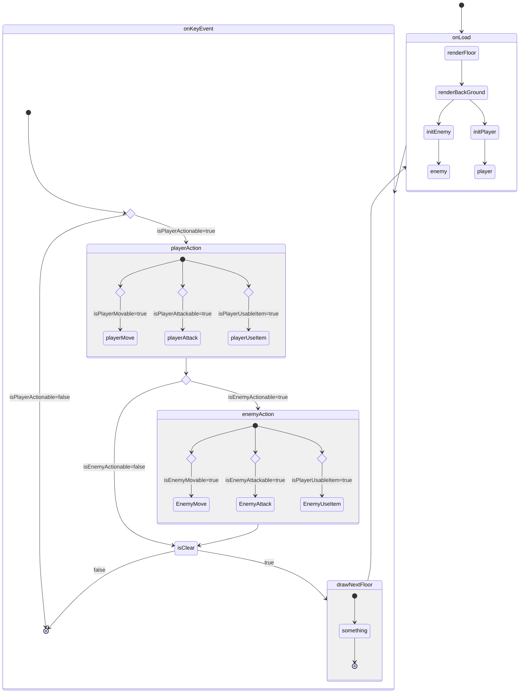
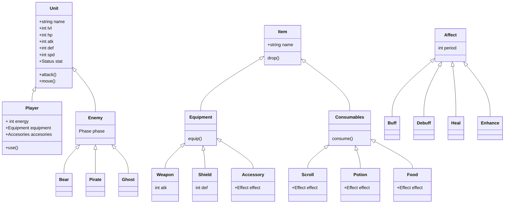

# ローグライクゲーム

## Phase
1-1 Player attackの実装
1-2 Player HP, Energyなどの実装
2-1 Enemyの実装
2-2 Enemy attackの実装

## 図

```mermaid
stateDiagram-v2
    [*] --> onLoad
    state onLoad {
        renderFloor --> renderBackGround
        renderBackGround --> initPlayer
        renderBackGround --> initEnemy
        initEnemy --> enemy 
        initPlayer --> player
    }

    onLoad --> onKeyEvent
    state onKeyEvent {
        state isPlayerActionable <<choice>>
        [*] --> isPlayerActionable
        isPlayerActionable --> playerAction: isPlayerActionable=true
        isPlayerActionable --> [*]: isPlayerActionable=false
        
        state playerAction {
            state isPlayerMovable <<choice>>
            [*] --> isPlayerMovable
            isPlayerMovable --> playerMove: isPlayerMovable=true
            state isPlayerAttackable <<choice>>
            [*] --> isPlayerAttackable
            isPlayerAttackable --> playerAttack: isPlayerAttackable=true
            state isPlayerUsableItem <<choice>>
            [*] --> isPlayerUsableItem
            isPlayerUsableItem --> playerUseItem: isPlayerUsableItem=true
        }

        state isEnemyActionable <<choice>>
        playerAction --> isEnemyActionable
        isEnemyActionable --> enemyAction: isEnemyActionable=true
        isEnemyActionable --> isClear: isEnemyActionable=false

        state enemyAction {
            state isEnemyMovable <<choice>>
            [*] --> isEnemyMovable
            isEnemyMovable --> EnemyMove: isEnemyMovable=true
            state isEnemyAttackable <<choice>>
            [*] --> isEnemyAttackable
            isEnemyAttackable --> EnemyAttack: isEnemyAttackable=true
            state isEnemyUsableItem <<choice>>
            [*] --> isEnemyUsableItem
            isEnemyUsableItem --> EnemyUseItem: isPlayerUsableItem=true
        }
        
        enemyAction --> isClear
        isClear --> drawNextFloor: true
        isClear --> [*]: false

        state drawNextFloor {
            [*] --> something
            something --> [*] 
        }

        
    }
    drawNextFloor --> onLoad
```

https://qiita.com/hirokiwa/items/1a490c75961efd1e1487

```mermaid
classDiagram
    class Unit{
        +string name
        +int lvl
        +int hp
        +int atk
        +int def
        +int spd
        +Status stat
        +attack()
        +move()
    }
    class Player{
        + int energy
        +Equipment equipment
        +Accesories accesories
        +use()
    }
    
    Unit <|-- Player

    class Enemy{
        Phase phase
    }
    
    Unit <|-- Enemy
    Enemy <|-- Bear
    Enemy <|-- Pirate
    Enemy <|-- Ghost

    class Item{
        +string name
        drop()
    }
    
    class Equipment{
        equip()
    }
    class Consumables{
        consume()
    }

    Item <|-- Equipment
    Item <|-- Consumables
    
    class Weapon{
        int atk
    }
    class Shield{
        int def
    }
    class Accessory{
        +Effect effect
    }

    Equipment <|-- Weapon
    Equipment <|-- Shield
    Equipment <|-- Accessory
    

    class Scroll{
        +Effect effect
    }
    class Potion{
        +Effect effect
    }
    class Food{
        +Effect effect
    }
    Consumables <|--Scroll
    Consumables <|--Potion
    Consumables <|--Food
    
    class Affect{
        int period
    }

    Affect <|-- Buff
    Affect <|-- Debuff
    Affect <|-- Heal
    Affect <|-- Enhance
```